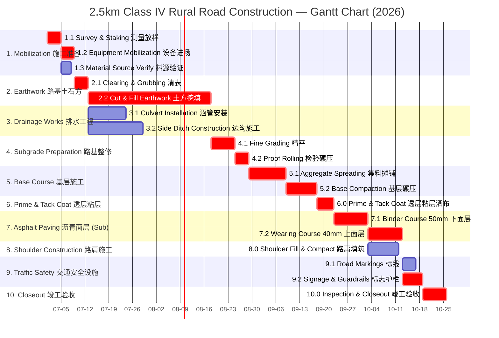

```mermaid
gantt
    dateFormat YYYY-MM-DD
    axisFormat  %m-%d
    title 2.5km Class IV Rural Road Construction — Gantt Chart (2026)

    section 1. Mobilization 施工准备
    1.1 Survey & Staking 测量放样                :crit, a1, 2026-07-01, 4d
    1.2 Equipment Mobilization 设备进场           :crit, a2, after a1, 4d
    1.3 Material Source Verify 料源验证            :a3, after a1, 3d

    section 2. Earthwork 路基土石方
    2.1 Clearing & Grubbing 清表                 :crit, b1, after a2, 4d
    2.2 Cut & Fill Earthwork 土方挖填             :crit, b2, after b1, 36d

    section 3. Drainage Works 排水工程
    3.1 Culvert Installation 涵管安装             :c1, after b1, 11d
    3.2 Side Ditch Construction 边沟施工           :c2, after b1, 16d

    section 4. Subgrade Preparation 路基整修
    4.1 Fine Grading 精平                        :crit, d1, after b2, 7d
    4.2 Proof Rolling 检验碾压                    :crit, d2, after d1, 4d

    section 5. Base Course 基层施工
    5.1 Aggregate Spreading 集料摊铺             :crit, e1, after d2, 11d
    5.2 Base Compaction 基层碾压                  :crit, e2, after e1, 9d

    section 6. Prime & Tack Coat 透层粘层
    6.0 Prime & Tack Coat 透层粘层洒布            :crit, f0, after e2, 5d

    section 7. Asphalt Paving 沥青面层 (Sub)
    7.1 Binder Course 50mm 下面层                :crit, g1, after f0, 10d
    7.2 Wearing Course 40mm 上面层               :crit, g2, after g1, 10d

    section 8. Shoulder Construction 路肩施工
    8.0 Shoulder Fill & Compact 路肩填筑          :h0, after g1, 9d

    section 9. Traffic Safety 交通安全设施
    9.1 Road Markings 标线                       :i1, after g2, 4d
    9.2 Signage & Guardrails 标志护栏             :crit, i2, after g2, 6d

    section 10. Closeout 竣工验收
    10.0 Inspection & Closeout 竣工验收            :crit, j0, after i2, 7d
```
```