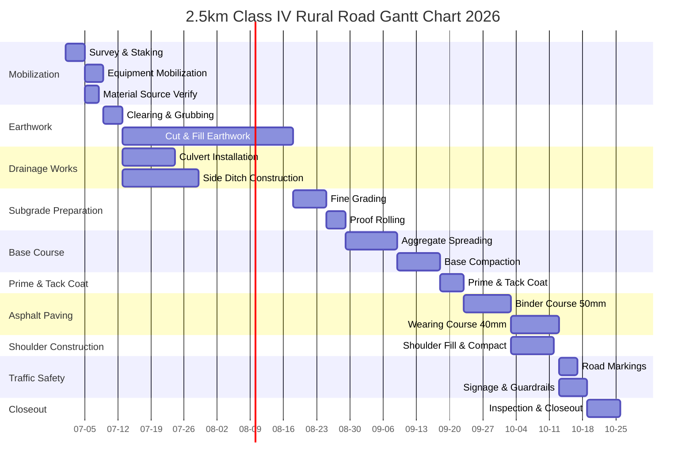

```mermaid
gantt
    dateFormat  YYYY-MM-DD
    axisFormat  %m-%d
    title 2.5km Class IV Rural Road Gantt Chart 2026

    section Mobilization
    Survey & Staking              :a1, 2026-07-01, 4d
    Equipment Mobilization         :a2, after a1, 4d
    Material Source Verify          :a3, after a1, 3d

    section Earthwork
    Clearing & Grubbing               :b1, after a2, 4d
    Cut & Fill Earthwork           :b2, after b1, 36d

    section Drainage Works
    Culvert Installation           :c1, after b1, 11d
    Side Ditch Construction         :c2, after b1, 16d

    section Subgrade Preparation
    Fine Grading                      :d1, after b2, 7d
    Proof Rolling                  :d2, after d1, 4d

    section Base Course
    Aggregate Spreading           :e1, after d2, 11d
    Base Compaction                :e2, after e1, 9d

    section Prime & Tack Coat
    Prime & Tack Coat          :f0, after e2, 5d

    section Asphalt Paving
    Binder Course 50mm              :g1, after f0, 10d
    Wearing Course 40mm             :g2, after g1, 10d

    section Shoulder Construction
    Shoulder Fill & Compact        :h0, after g1, 9d

    section Traffic Safety
    Road Markings                     :i1, after g2, 4d
    Signage & Guardrails           :i2, after g2, 6d

    section Closeout
    Inspection & Closeout          :j0, after i2, 7d
```